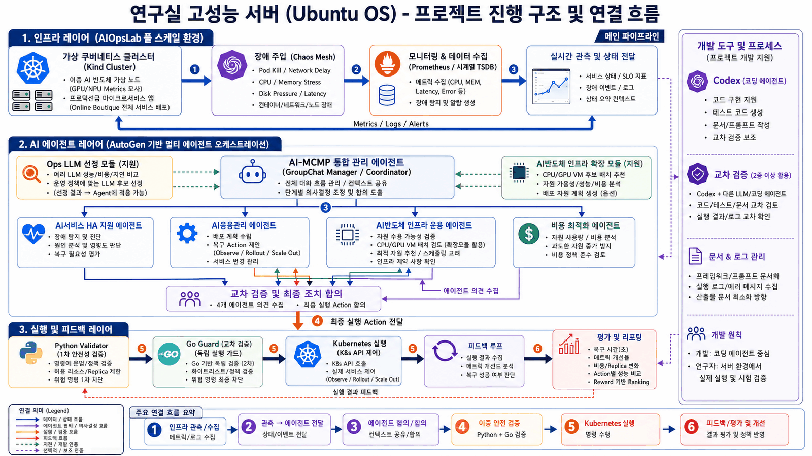

# AIOps 4-Agent Kubernetes 자동화 연구



## Agent 중심 통합 파이프라인 실행

이번 통합으로 기존에 따로 돌던 기능들이 하나의 운영 흐름으로 연결됐다.

```text
Ops LLM 선정
-> CPU/GPU VM 배치 계획
-> Kubernetes Deployment manifest 생성
-> manifest mock/dry-run 검증
-> Application / Infrastructure / Cost Agent 검토
-> 필요 시 AI-MCMP 4-Agent 복구 판단
-> Python Validator + Go Guard 실행 준비
```

상세한 서버 환경 준비, mock 실행, Kubernetes dry-run 실행, 성공 기준은 다음 runbook에 정리했다.

```text
docs/experiments/service_operations_environment.md
```

가장 먼저 확인할 명령:

```bash
aiops-k8s-agents run-service-operations \
  --llm-policy quality_first \
  --workload llm-chat-inference \
  --namespace online-boutique \
  --deployment paymentservice \
  --mode mock \
  --guard-backend go
```

정상 결과 핵심:

```text
selected_llm = gpt-5.5
selected_resource = gpu-vm-l4
deployment_manifest.kind = Deployment
deployment_dry_run.valid = true
agent_reviews.application.approved = true
agent_reviews.infrastructure.approved = true
agent_reviews.cost.approved = true
recovery_pipeline_ready = true
guard_backend = go
```

복구 판단까지 같이 연결하려면 장애 입력을 함께 준다.

```bash
aiops-k8s-agents run-service-operations \
  --llm-policy quality_first \
  --workload llm-chat-inference \
  --namespace online-boutique \
  --deployment paymentservice \
  --metric cpu \
  --value 95 \
  --threshold 80 \
  --mode mock \
  --guard-backend go
```

이 프로젝트는 Kubernetes 기반 서비스 장애 상황에서 4개의 AI Agent가 서로 다른 운영 관점을 나누어 판단하고, 검증된 action만 안전하게 실행하는 AIOps 연구 프로토타입입니다.

현재 중심은 **AIOpsLab 자체 개발**이 아니라, AIOpsLab/Chaos Mesh/Prometheus/Kubernetes 환경 위에서 동작하는 **4-Agent 서비스 제어 및 관리 자동화 구조**입니다.

## 교수님 요청, 연구 과제, 현재 프로젝트의 관계

이 저장소에는 두 흐름이 함께 들어 있다. 하나는 교수님이 요청한 **4-Agent 기반 AIOps 장애 감시/복구 연구**이고, 다른 하나는 대학원/ETRI 과제에서 요구하는 **AI 응용 배포/운용 및 멀티 클라우드 확장 준비 기능**이다. 둘은 완전히 같은 과제는 아니지만, Agent 기반 운영 자동화라는 상위 목표 아래에서 연결된다.

| 구분 | 핵심 목표 | 현재 구현/산출물 |
| --- | --- | --- |
| 교수님 요청 연구 | 4개 Agent가 장애 상태를 판단하고 안전한 Kubernetes 복구 action을 결정 | 4-Agent, action/reward, Chaos Mesh, Prometheus, Kubernetes real 실행 |
| 대학원/ETRI 과제 요구 | Go 개발, 2종 이상 LLM/코딩 Agent 교차 검증, AI App 배포/운용, CPU/GPU VM 배치 준비 | Go Guard, Codex 교차 검증 문서, Ops LLM 선정, CPU/GPU VM 배치/배포 계획 |
| 통합 프로젝트 | 장애 복구 연구와 AI 응용 배포/운용 과제 기능을 하나의 Agent 중심 운영 파이프라인으로 연결 | `run-service-operations`, Python Validator + Go Guard, 배포 manifest dry-run |

통합하면 좋은 점은 명확하다. 장애 복구 연구에서 만든 관측, Agent 판단, 안전 검증, 실행 로그 구조를 AI App 배포/운용 과제에도 재사용할 수 있고, 과제에서 요구하는 Go/LLM 교차 검증/배포 전략은 기존 AIOps 연구의 안전성과 산출물 완성도를 높인다.

자세한 구분과 설계는 아래 문서에 정리했다.

```text
docs/design/research_task_integration_design.md
docs/submission/execution_code_guide.md
```

## 현재까지 완료된 핵심

| 구분 | 상태 |
| --- | --- |
| 4-Agent 역할, action, reward 정책 | 완료 |
| AutoGen GroupChat 기반 Agent 대화 경로 | 완료 |
| Prometheus metric 입력 | 완료 |
| Chaos Mesh 장애 4종 실험 | 완료 |
| AIOpsLab Hotel Reservation 탐지 benchmark | 완료 |
| Kubernetes dry-run/real 실행 | 완료 |
| Go 언어 기반 최종 action guard | 완료 |
| 2종 코딩/LLM 관점 교차 검증 문서 | 완료 |
| Agent 등록 관리 프로토타입 | 완료 |
| CPU/GPU VM 기반 추론 배치 최적화 프로토타입 | 완료 |
| Reward 정책 변화와 장애별 action ranking 실험 | 완료 |
| Agent 중심 AI 서비스 운영 통합 파이프라인 | 완료 |
| Kubernetes server-side AI 서비스 배포 dry-run | 완료 |

## 전체 구조

```text
AIOpsLab / Chaos Mesh 장애
-> Prometheus / Kubernetes 상태 관측
-> AI-MCMP Coordinator
-> 4-Agent 판단
   - HA 지원 Agent
   - 응용관리 Agent
   - AI반도체 인프라 운용 Agent
   - 비용 최적화 Agent
-> Action / Reward 교차 검증
-> Python Validator + Go Guard
-> kubectl dry-run 또는 real 실행
-> before / after 상태와 metric 저장
```

## 4-Agent 역할

| Agent | 담당 내용 |
| --- | --- |
| `AIServiceHASupportAgent` | 서비스 장애 진단, 가용성 판단, 자율 복구 필요성 평가 |
| `AIApplicationManagementAgent` | 응용 배포, 복구 action 선택, Kubernetes 제어 절차 관리 |
| `AISemiconductorInfraOpsAgent` | CPU/GPU/NPU 자원 수용성, replica 증가, VM 배치 가능성 검증 |
| `CostOptimizationAgent` | 자원 증가 비용, 과잉 action, 비용 우선 정책 검증 |

Agent 정의 파일:

```text
config/agent_registry.json
```

## 실행 환경 구분

| 환경 | 용도 |
| --- | --- |
| `base` | Anaconda 기본 환경 |
| `aiops_research` | 우리 프로젝트 실행, pytest, 4-Agent CLI, Go guard |
| `aiopslab` | 외부 AIOpsLab 공식 코드 실행 |

보통 우리 프로젝트 작업은 다음 환경에서 한다.

```bash
conda activate aiops_research
cd ~/geonhae/aiops_research
```

## 설치 및 테스트

### 서버

```bash
cd ~/geonhae/aiops_research
conda activate aiops_research
git pull origin master
python -m pip install -e ".[dev,autogen]"
python -m pytest
```

Go guard 테스트:

```bash
cd ~/geonhae/aiops_research/go/aiops-guard
go test ./...
go run ./cmd/aiops-guard --input ../../examples/go_guard_scale_action.json
```

### Windows 로컬

```powershell
cd C:\Users\geonhae\Documents\aiops_research
.\.venv\Scripts\python.exe -m pytest
```

## 기본 명령

### 1. Agent 등록 관리

```bash
aiops-k8s-agents list-agents \
  --registry config/agent_registry.json
```

```bash
aiops-k8s-agents validate-agent-action \
  --registry config/agent_registry.json \
  --agent AIApplicationManagementAgent \
  --action app_scale_deployment
```

### 2. CPU/GPU VM 추론 배치 추천

```bash
aiops-k8s-agents recommend-inference-placement \
  --config config/inference_optimization.json \
  --workload llm-chat-inference
```

기대 결과:

```text
selected_resource = gpu-vm-l4
action = deploy_on_gpu_vm
```

가벼운 텍스트 모델:

```bash
aiops-k8s-agents recommend-inference-placement \
  --config config/inference_optimization.json \
  --workload text-classifier
```

기대 결과:

```text
selected_resource = cpu-vm-standard
action = deploy_on_cpu_vm
```

### 3. Kubernetes recovery action 실행

```bash
aiops-k8s-agents execute-recovery-action \
  --mode real \
  --guard-backend go \
  --action rollout_restart \
  --namespace online-boutique \
  --deployment paymentservice \
  --allowed-namespace online-boutique \
  --allowed-deployment paymentservice
```

## 서버 real 실험

전제:

```bash
export PATH="$HOME/bin:$PATH"
export KUBECONFIG="$HOME/geonhae/kubeconfigs/kind-geonhae-aiops.yaml"
kubectl get nodes
```

Prometheus port-forward는 별도 터미널에서 계속 켜둔다.

```bash
kubectl port-forward \
  -n monitoring-full \
  service/kube-prometheus-stack-prometheus \
  9091:9090
```

실험 터미널:

```bash
export PROM=http://127.0.0.1:9091
export NETWORK_LATENCY_QUERY='max(probe_duration_seconds{target="paymentservice"})'
curl -sS "$PROM/-/ready"
```

36회 recovery action 실험:

```bash
GUARD_BACKEND=go \
MODE=real \
REPETITIONS=3 \
PROMETHEUS_URL="$PROM" \
NETWORK_LATENCY_QUERY="$NETWORK_LATENCY_QUERY" \
bash scripts/server_recovery_action_pilot.sh
```

결과 확인:

```bash
LATEST=$(ls -dt runs/recovery-action-pilot/*/ | head -1)
wc -l "$LATEST/outcomes.jsonl"
cat "$LATEST/analysis/reward_policy_comparison.md"
```

성공 기준:

```text
36 outcomes.jsonl
```

## 실제 장애 시나리오

| 장애 | 도구 | 대상 |
| --- | --- | --- |
| `pod-kill` | Chaos Mesh | `paymentservice` |
| `cpu-stress` | Chaos Mesh | `paymentservice` |
| `memory-stress` | Chaos Mesh | `checkoutservice` |
| `network-delay` | Chaos Mesh + blackbox exporter | `paymentservice` |

CPU 95% 입력은 초기 smoke test용 mock 시나리오다. 현재 연구 결과의 중심은 위의 실제 Chaos Mesh/AIOpsLab 기반 실험이다.

## 주요 문서

| 문서 | 내용 |
| --- | --- |
| `docs/design/research_task_integration_design.md` | 교수님 요청 연구와 대학원/ETRI 과제 요구의 범위 구분 및 통합 설계 |
| `docs/submission/execution_code_guide.md` | 실행 코드 설명서 |
| `docs/experiments/service_operations_environment.md` | Agent 중심 AI 서비스 운영 통합 실험 환경과 실행 코드 |
| `docs/submission/requirements_definition.md` | 요구사항 정의서 |
| `docs/design/agent_registry_guide.md` | AI Agent 등록 관리 가이드 |
| `docs/design/inference_optimization_guide.md` | CPU/GPU VM 추론 최적화 가이드 |
| `docs/submission/functional_api_guide.md` | 기능/API 사용 가이드 |
| `docs/submission/test_guide.md` | 시험 검증 가이드 |
| `docs/design/go_and_llm_cross_validation.md` | Go 언어 및 LLM 교차 검증 정리 |
| `docs/experiments/recovery_action_experiment_guide.md` | 장애별 action/reward 실험 가이드 |
| `docs/archive/first_stage_research_completion.md` | 1차 연구 완료 범위 정리 |

## 현재 연구 단계

현재 단계는 **1차 통합 프로토타입 구현 및 실험 검증 완료**로 볼 수 있다.

완료된 내용:

- 4-Agent 구조 구현
- 실제 장애 주입과 metric 관측
- Kubernetes real action 실행
- Go guard 기반 최종 action 검증
- Agent 등록 관리
- CPU/GPU VM 기반 추론 최적화 정책
- Reward 정책 변화에 따른 장애별 action ranking 비교
- Agent 중심 AI 서비스 운영 통합 파이프라인
- AI 서비스 Deployment manifest 생성 및 Kubernetes server-side dry-run 검증

다음 연구 확장:

- single-agent baseline 비교
- Agent 제거 ablation 실험
- AutoGen multi-round real action 선택
- 실제 GPU/NPU 스케줄링과 모델 추론 서비스 연동
- 통계 검정과 그래프 기반 정량 평가

## 추가 완료 항목: LLM 선정 및 AI 응용 배포/제어 전략

다음 두 항목도 코드, CLI, 테스트, 문서 산출물로 정리했다.

| 개발 항목 | 완료 산출물 |
| --- | --- |
| Ops 분석 시험 및 최적 LLM 선정 | `config/ops_llm_benchmark.json`, `docs/design/ops_llm_selection_guide.md`, `aiops-k8s-agents select-ops-llm` |
| CPU/GPU VM 기반 AI 응용 배포/제어 추론 최적화 전략 | `config/inference_optimization.json`, `docs/design/ai_application_deployment_strategy.md`, `aiops-k8s-agents plan-inference-deployment` |

실행 명령:

```bash
aiops-k8s-agents select-ops-llm \
  --config config/ops_llm_benchmark.json \
  --policy quality_first
```

```bash
aiops-k8s-agents plan-inference-deployment \
  --config config/inference_optimization.json \
  --workload llm-chat-inference
```

## 추가 완료 항목: 정량 그래프/통계 분석

Recovery action 실험 결과를 이용해 평균 복구 시간, 성공률, reward 정책 차이를 표와 SVG 그래프로 생성하는 기능을 추가했다.

```bash
LATEST=$(ls -dt runs/recovery-action-pilot/*/ | head -1)

aiops-k8s-agents summarize-recovery-statistics \
  --input "${LATEST}outcomes.jsonl" \
  --output-dir "${LATEST}statistics"
```

산출물:

```text
statistics/quantitative_summary.md
statistics/scenario_action_statistics.csv
statistics/policy_reward_statistics.csv
statistics/mean_recovery_seconds_by_action.svg
statistics/success_rate_by_action.svg
statistics/reward_by_policy.svg
```
