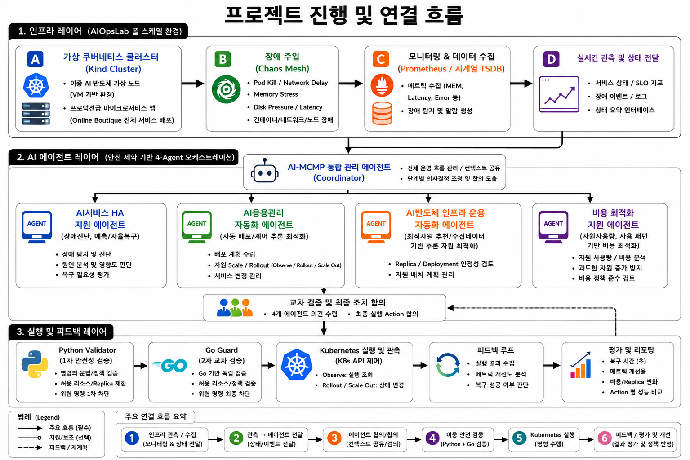

# AIOps Multi-Agent Research Framework

역할 기반 Agent의 판단·상호 검토·안전 검증·실행 결과를 재현 가능한 실험으로
구성하는 대학원 연구 프레임워크입니다. 현재 검증된 기본 프로파일은 Kubernetes
장애 복구이며, AI workload orchestration 연구를 위한 모델 분할 계획 프로파일을
별도 모듈로 제공합니다.



## 핵심 흐름

```text
Chaos Mesh / AIOpsLab
        -> Evidence: Prometheus + Kubernetes
        -> Coordinator + 4-Agent 판단
        -> 상호 검토 / Action / Reward
        -> Python Validator
        -> Kubernetes 복구 Action
        -> Recovery Monitor / 결과 분석
```

| 구성 | 역할 |
| --- | --- |
| HA Agent | 가용성·장애 영향·복구 필요성 판단 |
| Application Agent | observe / rollout restart / scale-out 제안 |
| Infrastructure Agent | replica·자원·인프라 제약 검토 |
| Cost Agent | 비용 증가와 과잉 대응 검토 |
| Coordinator | Agent 의견 수집, 합의와 재협상 관리 |
| Python Validator | allowlist, namespace, deployment, replica, 명령 안전성 검증 |
| AutoGen | 선택 가능한 LLM GroupChat 경로. API 키가 있을 때만 사용 |
| AIOpsLab | 별도 장애 탐지 benchmark. Chaos Mesh 복구 실험과 구분 |
| Model Partition Orchestration Agent | 승인된 상위 Round Plan을 논리 분할·실행 DAG·자원 요구량 계획으로 변환 |

## 연구 프로파일

| 프로파일 | Agent 구성 | 연구 범위 |
| --- | --- | --- |
| 장애 복구 | HA / Application / Infrastructure / Cost | 장애 진단, 복구 Action 합의, 안전한 Kubernetes 제어 |
| 모델 분할 오케스트레이션 | Model Partition Orchestration Agent | 승인된 실행 모드에 대한 후보 분할 비교, 실행 DAG, 자원·통신 추정, 독립 검증 |

모델 분할 Agent는 장애 복구의 다섯 번째 Agent가 아닙니다. 또한 FL, SL, 일반 분산
추론 중 어떤 실행 모드를 사용할지 결정하지 않습니다. 상위 Federated Coordination
계층이 승인한 `execution_mode`, `approved_by`, `approval_ref`를 입력으로 받으며,
승인 provenance가 없으면 fail-closed로 계획을 거부합니다. 검증된
`PartitionExecutionPlan`은 후속 Scheduling Agent가 사용할 수 있는 계약입니다.

## 실행 모드

| 모드 | 의미 |
| --- | --- |
| `mock` | 합성 Evidence로 전체 흐름을 확인. 클러스터 변경 없음 |
| `dry-run` | 대상·명령·정책을 검증. 클러스터 변경 없음 |
| `real` | Ubuntu 클러스터에서 Chaos Mesh와 Kubernetes Action을 실제 실행 |

`mock`과 `dry-run` 결과는 실제 장애 복구 성능의 근거가 아닙니다. `real`은
allowlist, replica 제한, Validator, cleanup, 실행 확인 문구를 모두 통과해야 합니다.

## Ubuntu에서 처음 실행하기

아래 절차는 이미 Kind 또는 Kubernetes, Online Boutique,
`kube-prometheus-stack`, Chaos Mesh가 준비된 서버를 기준으로 합니다.
이 저장소는 클러스터와 외부 AIOpsLab 저장소를 자동 설치하지 않습니다.

### 1. 프로젝트와 Python 환경

```bash
git clone https://github.com/gunsun2000/aiops_research.git
cd aiops_research

conda create -n aiops_research python=3.13 -y
conda activate aiops_research
python -m pip install -e ".[dev,autogen,ui,docs]"
```

공식 [AIOpsLab](https://github.com/microsoft/AIOpsLab)은 별도 checkout과
`aiopslab` 환경에 설치합니다. 처음 준비할 때는 다음을 실행하고, 상세 설치는
AIOpsLab 저장소의 `TutorialSetup.md`를 따릅니다.

```bash
mkdir -p "$HOME/geonhae/external"
git clone https://github.com/microsoft/AIOpsLab.git \
  "$HOME/geonhae/external/AIOpsLab"
conda create -n aiopslab python=3.11 -y
conda activate aiopslab
cd "$HOME/geonhae/external/AIOpsLab"
python -m pip install -e "."

export AIOPSLAB_ROOT="$HOME/geonhae/external/AIOpsLab"
export AIOPSLAB_PYTHON="$HOME/anaconda3/envs/aiopslab/bin/python"
```

### 2. 한 번에 연결 확인 후 Control Plane 시작

최초 설치가 끝난 뒤에는 아래 명령만 사용합니다. 현재 Conda 환경이 `base`여도
스크립트가 `aiops_research` Python을 자동으로 찾습니다. 기존 Control Plane은 안전하게
재시작하고, 서버는 백그라운드에서 유지됩니다.

```bash
cd ~/geonhae/aiops_research
git pull origin master
bash scripts/start_research_console.sh
```

스크립트는 다음 작업을 한 번에 수행합니다.

- `aiops_research` Python 환경 자동 선택
- 필요한 UI 패키지가 없을 때 저장소 자동 설치
- 기존 Control Plane 안전 재시작과 포트 충돌 확인
- `/healthz` 기반 실제 준비 완료 확인
- Kubernetes context와 Chaos Mesh API 자동 탐색
- Prometheus 자동 포트포워딩
- 외부 AIOpsLab Python runtime 자동 탐색
- AutoGen API 키 설정 여부 표시

상태 확인과 종료도 같은 스크립트를 사용합니다.

```bash
bash scripts/start_research_console.sh status
bash scripts/start_research_console.sh stop
```

클러스터 또는 AIOpsLab이 잠시 준비되지 않아도 Mock 웹 콘솔은 시작됩니다. 이 경우
미연결 항목과 원인은 시작 결과와 웹의 `시스템 연결 상태`에 표시됩니다. AutoGen은
API 키가 없으면 `설정 필요`로 표시되며 deterministic Controller는 계속 사용할 수 있습니다.

### 3. 연결 상태 확인

시작 명령이 `/healthz`와 연결 상태를 직접 확인해 출력합니다. 필요하면 다음 명령으로
같은 내용을 다시 확인할 수 있습니다.

```bash
curl -sS http://127.0.0.1:18180/healthz
curl -sS http://127.0.0.1:18180/api/connections | python -m json.tool
```

정상적인 deterministic/mock 준비 상태는 다음과 같습니다.

```text
Kubernetes: ready = true
Prometheus: ready = true (platform-managed port-forward)
Chaos Mesh: ready = true
AIOpsLab: ready = true
AutoGen: ready = false, status = missing_credentials
missing_prerequisites: []
```

Prometheus가 이미 응답 중이면 기존 연결을 재사용하고, 응답하지 않으면 플랫폼이
자동으로 다음 port-forward를 실행합니다.

```text
kubectl port-forward -n monitoring-full \
  service/kube-prometheus-stack-prometheus 9091:9090
```

따라서 사용자가 매번 Prometheus 포트포워딩 터미널을 별도로 켤 필요는 없습니다.
단, Kubernetes context와 Prometheus Service가 서버에 존재해야 합니다.

웹 브라우저:

```text
http://127.0.0.1:18180/
```

Ubuntu 원격 서버의 Control Plane은 항상 **Ubuntu 원격 포트 `18180`**에서 실행합니다.
VS Code Remote SSH를 사용하면 VS Code가 이 원격 포트를 Windows의 **로컬 포트**로
전달합니다. 로컬 포트 번호는 VS Code가 선택하므로 `18181`로 고정하지 마십시오.
VS Code의 Ports 탭에서 원격 포트 `18180`을 열고 `Open in Browser`를 누릅니다.

저장소의 `.vscode/settings.json`은 `18180` 자동 전달과 브라우저 열기를 요청합니다.
`.vscode/tasks.json`에는 `AIOps: start research console`, `AIOps: console status`,
`AIOps: stop research console` 작업이 있습니다. 서버는 백그라운드에서 유지되므로 시작
터미널을 계속 열어둘 필요가 없습니다.

Windows에서 `127.0.0.1:18180`을 직접 여는 것은 Ubuntu 원격 서버에 자동 연결되는
방법이 아닙니다. 반드시 VS Code Ports 탭에 표시된 **로컬 전달 주소**를 사용합니다.

## AutoGen 사용하기

AutoGen은 선택 기능입니다. API 키가 없으면 UI에 `API 키 미설정`으로 표시되고
deterministic, mock, dry-run 경로는 계속 사용할 수 있습니다.

```bash
export OPENAI_API_KEY="<your-api-key>"
export AIOPS_OPENAI_MODEL="gpt-5.5"
bash scripts/start_research_console.sh
```

키는 README, shell history, 요청 body, 결과 파일, Git에 저장하지 마십시오.
AutoGen GroupChat을 실제 호출할 때는 모델 접근 권한과 API quota도 필요합니다.

## 실험 실행

### 웹 Control Plane

1. `Recovery Experiment`에서 장애 시나리오를 선택합니다.
2. `Deterministic` 또는 API 키가 설정된 `AutoGen` Controller를 선택합니다.
3. `Mock`으로 흐름을 먼저 확인합니다.
4. `Dry-run`으로 대상과 안전 정책을 확인합니다.
5. Ubuntu 실험 서버에서만 `Real`을 명시적으로 실행합니다.

### CLI Mock 확인

```bash
aiops-k8s-agents mutual-supervision-run \
  --mode mock \
  --namespace online-boutique \
  --deployment paymentservice \
  --metric cpu \
  --threshold 80 \
  --evidence-value 95 \
  --allowed-namespace online-boutique \
  --allowed-deployment paymentservice
```

### Chaos Mesh Real 복구 실험

Real 실험은 Prometheus와 클러스터 상태를 먼저 확인한 뒤 실행합니다.

```bash
export CONFIRM_REAL_RUN=YES
export NETWORK_LATENCY_QUERY='max(probe_duration_seconds{target="paymentservice"})'

GUARD_BACKEND=go \
MODE=real \
REPETITIONS=3 \
PROMETHEUS_URL="$PROMETHEUS_URL" \
NETWORK_LATENCY_QUERY="$NETWORK_LATENCY_QUERY" \
bash scripts/server_recovery_action_pilot.sh
```

결과는 `runs/recovery-action-pilot/`에 JSONL, CSV, Markdown, PNG, SVG로 저장됩니다.
정량 결과는 다음 명령으로 생성합니다.

```bash
bash scripts/server_recovery_statistics.sh
```

### AIOpsLab Benchmark

AIOpsLab benchmark는 Chaos Mesh 복구 실험과 별도의 탐지 실험입니다.

```bash
conda activate aiopslab
cd ~/geonhae/aiops_research
bash scripts/server_aiopslab_auto_detection.sh
```

반복 실행과 요약:

```bash
bash scripts/server_aiopslab_repeat_detection.sh
bash scripts/server_aiopslab_summarize_runs.sh
```

### Model Partition Orchestration

`AI Workload Orchestration`은 Recovery Profile과 분리된 planning workspace입니다.

```text
Approved Coordination Plan
  -> Common Processing Core
  -> Training / Inference Partition Strategy
  -> Deterministic Candidate Generation + Hard Feasibility Filter
  -> Candidate Ranking (Deterministic / Shadow / Learned Guarded)
  -> Independent Validation
  -> Versioned PartitionExecutionPlan
  -> Scheduling Handoff
  -> Bounded Feedback Repartition
```

후보 생성과 Hard Constraint 판정은 항상 결정론적 코어가 담당합니다. AI Ranker는
feasible 후보만 순위화하며, `shadow`는 최종 선택을 바꾸지 않고 `learned_guarded`는
등록 모델과 안전 Guard를 모두 통과한 경우에만 선택에 관여합니다. 실패하면 Baseline으로
폴백하고, 최종 계획은 독립 `PartitionPlanValidator`가 다시 검증합니다.

Orchestrator는 상위 계층이 승인한 실행 모드를 소비할 뿐 FL, SL, 또는 추론 모드를
선택하지 않습니다. `Scheduling Handoff`는 외부 Scheduling Agent에 전달할 계약과
artifact를 준비하는 단계이며, Scheduling, placement, GPU 사용, 학습/추론 runtime 실행은
이 저장소의 범위 밖입니다. 웹의 reward와 성능 값은 source와 timestamp가 있는 observed
evidence가 명시되지 않는 한 **실행 전 예측**입니다.

처음에는 editable install로 현재 checkout의 CLI를 사용합니다.

```bash
python -m pip install -e .
aiops-k8s-agents plan-model-partition-v2 \
  --input config/examples/model_partition_inference_v2.json \
  --policy config/model_partition_policy.json \
  --artifact-root runs/model-partition
```

상세 구조는 [Orchestrator Agent 설계](docs/design/model_partition_orchestrator_agent_design.md),
학습·비교 절차는 [Reward Ranker 실험 가이드](docs/experiments/partition_ranker_experiment_guide.md),
전체 명령은 [실행 코드 가이드](docs/submission/execution_code_guide.md), 재현성 기준은
[시험 가이드](docs/submission/test_guide.md)에서 확인합니다.

## 코드 검증

```bash
conda activate aiops_research
python -m pytest
```

Go Guard가 설치된 checkout에서는 선택적으로 다음을 실행합니다.

```bash
cd go/aiops-guard
go test ./...
```

## 문서 바로가기

| 문서 | 내용 |
| --- | --- |
| [문서 목록](docs/README.md) | 전체 문서 구조 |
| [설치·실행 가이드](docs/submission/install_and_run_guide.md) | 환경별 상세 설치 |
| [Real runtime 가이드](docs/experiments/platform_real_runtime_guide.md) | Prometheus·Chaos Mesh·Kubernetes 검증 |
| [Recovery 실험 가이드](docs/experiments/recovery_action_experiment_guide.md) | 장애별 Action 실험 |
| [정량 분석 가이드](docs/experiments/recovery_quantitative_analysis_guide.md) | 성공률·복구 시간·Reward 분석 |
| [Control Plane UI 가이드](docs/submission/control_plane_ui_guide.md) | 웹 화면과 API |
| [연구 보고서](docs/deliverables/AIOps_4Agent_Research_Report.docx) | 발표·검토용 DOCX |

## 범위의 정확한 표현

- `FakeEvidenceProvider` 기반 autonomous loop는 mock/test용으로 구현되어 있습니다.
- `KubernetesEvidenceProvider`는 deployment/pod snapshot 중심의 보수적 provider입니다.
- Prometheus metric, log enrichment, full real-cluster evidence fusion은 후속 확장입니다.
- AIOpsLab benchmark 결과와 Chaos Mesh recovery 결과는 같은 Control Plane에서
  조회하더라도 서로 다른 실험 근거로 기록합니다.
