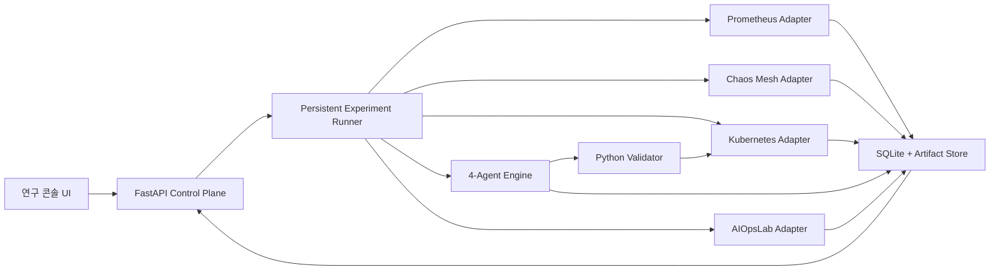

# 4-Agent AIOps 연구 플랫폼 v1 통합 설계

## 1. 목적

본 설계의 목표는 기존 `aiops_research` 저장소에 분리되어 있는 CLI 실험,
4-Agent 상호감시, 안전 검증, AIOpsLab benchmark, 정량 분석 기능을 하나의
연구 플랫폼으로 연결하는 것이다.

플랫폼은 다음 연구 질문을 반복적으로 검증할 수 있어야 한다.

- 4-Agent 역할 분리와 상호감시가 장애 대응 판단에 어떤 영향을 주는가?
- 합의 정책과 Reward 정책에 따라 선택되는 복구 Action이 어떻게 달라지는가?
- deterministic Agent와 AutoGen Agent의 판단 결과는 어떻게 다른가?
- 안전 경계를 적용한 자율 복구가 실제 Kubernetes 환경에서 재현 가능한가?

최종 플랫폼은 단발성 시연 화면이 아니다. 장애, Agent 구성, 합의 전략,
Action, Reward, 반복 횟수를 변경하면서 지속적으로 실험하고 결과를 비교하는
연구 실행 환경이다.

## 2. 연구 범위와 완료 정의

### 2.1 v1 범위

v1은 Ubuntu 연구실 서버에서 다음 흐름을 하나의 `experiment_id`로 실행한다.

```text
실험 조건 설정
  -> 환경 연결 확인
  -> Chaos Mesh 장애 주입
  -> Prometheus/Kubernetes Evidence 수집
  -> 4-Agent 판단 및 상호검토
  -> 재협상 및 최종 합의
  -> Python Validator 안전 검증
  -> Kubernetes Action 실행
  -> 복구 관찰
  -> 통계 및 산출물 저장
```

AutoGen과 AIOpsLab은 항상 실행되는 필수 단계가 아니다.

- AutoGen은 `deterministic`과 교체 가능한 Agent 실행 방식이다.
- AIOpsLab은 동일 플랫폼에서 실행하는 별도 benchmark Job이다.
- 핵심 Chaos Mesh 복구 실험은 두 기능을 사용하지 않아도 실행할 수 있다.

### 2.2 v1 완료 조건

다음 조건을 모두 만족하면 플랫폼 v1 구현 완료로 판단한다.

1. 웹에서 `mock`, `dry-run`, `real` 실행 경계가 명확히 구분된다.
2. Prometheus, Chaos Mesh, Kubernetes Adapter가 실제 서버 환경과 연결된다.
3. 장시간 실험이 백그라운드 Job으로 실행되고 상태, 로그, 취소가 제공된다.
4. 모든 단계가 동일한 `experiment_id`와 `ExperimentSession`으로 기록된다.
5. 4-Agent 상호검토, veto, 재협상, 합의 근거가 저장되고 화면에 표시된다.
6. Validator, allowlist, replica 제한, timeout, cleanup이 real 실행에 적용된다.
7. AutoGen GroupChat을 선택 가능한 Controller로 실행할 수 있다.
8. AIOpsLab benchmark를 별도 Job으로 실행하고 결과를 조회할 수 있다.
9. 비교 실험과 정량 분석 결과를 JSONL, CSV, PNG, Markdown으로 제공한다.
10. 서버 재시작 후 실험 상태와 완료 산출물을 다시 조회할 수 있다.
11. 단위, 통합, 브라우저 E2E, 주요 실패 경로 테스트가 통과한다.

v1 완료는 연구 종료를 뜻하지 않는다. v1은 이후 논문 실험을 반복 수행하는
안정적인 실험 기반의 완성을 의미한다.

## 3. 현재 기반과 이번 변경 범위

현재 저장소에는 다음 기반이 존재한다.

- 4-Agent deterministic Coordinator와 상호감시 Coordinator
- 프로파일 기반 Agent Registry와 합의 전략
- 역할별 veto, 전체 veto, 가중 다수결
- AutoGen 실행 경계와 독립 CLI
- Python Validator와 선택적 Go Guard
- Prometheus Adapter와 Kubernetes 상태 수집
- Chaos Mesh manifest와 real 실험 스크립트
- AIOpsLab 자동 탐지 실행 및 결과 요약 코드
- Recovery Action 반복 실험과 정량 분석 코드
- 정규화된 `ExperimentSession`과 in-memory store
- FastAPI Control Plane과 mock 실험 UI

이번 변경은 위 기능을 다시 작성하지 않는다. 기존 모듈을 Adapter와 Job
인터페이스 뒤에 연결하고 웹 플랫폼의 단일 세션 흐름으로 통합한다.

## 4. 시스템 아키텍처



### 4.1 설계 원칙

- UI는 Kubernetes 명령을 직접 실행하지 않는다.
- API는 요청 검증과 Job 생성만 담당한다.
- Experiment Runner가 전체 실행 순서와 cleanup을 소유한다.
- 각 외부 시스템은 명시적인 Adapter 인터페이스로 격리한다.
- `ExperimentSession`을 UI와 결과 저장의 단일 진실 공급원으로 사용한다.
- mock 결과를 real 결과와 같은 방식으로 표시하지 않는다.
- 안전 검증 실패는 실행 실패가 아니라 `blocked` 연구 결과로 기록한다.
- 기존 CLI는 유지하며 웹과 동일한 핵심 실행 서비스를 재사용한다.

## 5. 실행 모드

| 모드 | Evidence | 장애 주입 | Kubernetes 변경 | 용도 |
| --- | --- | --- | --- | --- |
| `mock` | FakeEvidenceProvider | 없음 | 없음 | UI, 정책, 반복 가능한 테스트 |
| `dry-run` | 실제 또는 제한적 snapshot | 선택적 | server dry-run | 환경 호환성 및 명령 검증 |
| `real` | Prometheus + Kubernetes | Chaos Mesh | 실제 bounded Action | 연구실 서버 실험 |

`real` 실행은 다음 조건을 모두 만족해야 시작된다.

- 서버 시작 시 real 실행 기능이 활성화되어 있다.
- 사용자가 UI에서 정확한 확인 문구를 입력한다.
- namespace와 deployment가 allowlist에 포함된다.
- Kubernetes, Prometheus, Chaos Mesh 사전 점검이 성공한다.
- 동일 대상에 대한 operation lock을 획득한다.

## 6. Persistent Experiment Runner

### 6.1 Job 수명주기

```text
queued
  -> preflight
  -> injecting_fault
  -> collecting_evidence
  -> agent_reasoning
  -> negotiating
  -> validating
  -> executing
  -> observing_recovery
  -> analyzing
  -> completed | blocked | failed | cancelled
```

Job은 HTTP 요청 수명과 독립적으로 동작한다. 브라우저가 새로고침되거나 연결이
끊겨도 서버의 실험은 계속되며, 사용자는 `experiment_id`로 다시 연결한다.

### 6.2 Job 책임

- 실행 전 capability와 target 검사
- 단계별 timeout 적용
- 상태와 이벤트를 SQLite에 기록
- 실행 로그와 주요 데이터의 비밀정보 제거
- 취소 요청 처리
- 성공, 실패, 취소 여부와 관계없는 cleanup 실행
- 최종 `ExperimentSession` 정규화
- 통계 분석과 산출물 생성 요청

### 6.3 취소 의미

취소는 이미 실행된 Kubernetes 변경을 임의로 되돌리는 명령이 아니다.
Runner는 현재 단계를 중단하고 등록된 cleanup을 수행한 뒤, 실제 상태를 다시
관찰하여 `cancelled` 결과와 잔여 영향 여부를 기록한다.

## 7. Real Adapter

### 7.1 Prometheus Adapter

책임은 다음과 같다.

- readiness 확인
- 허용된 PromQL template 실행
- CPU, memory, availability, restart, latency Evidence 수집
- 응답 timestamp와 label 원문 저장
- 빈 결과, stale sample, timeout 구분

사용자가 UI에서 임의 PromQL을 real 실행에 직접 전달하지 않는다. 등록된
metric policy와 query template을 선택하도록 제한한다.

### 7.2 Chaos Mesh Adapter

책임은 다음과 같다.

- 등록된 장애 시나리오 manifest 생성 또는 적용
- namespace와 selector 검증
- 주입 상태와 선택된 Pod 확인
- duration과 timeout 관리
- 장애 리소스 삭제 및 recovery 확인

v1 기본 시나리오는 다음 네 가지다.

- `pod-kill`
- `cpu-stress`
- `memory-stress`
- `network-delay`

### 7.3 Kubernetes Adapter

책임은 다음과 같다.

- deployment/pod snapshot 수집
- server dry-run 실행
- 허용된 bounded Action 실행
- rollout 및 replica 상태 확인
- 실행 전후 상태 차이 저장

v1 기본 Action space는 다음 세 가지다.

- `observe_only`
- `rollout_restart`
- `scale_out`

새로운 Action은 Adapter 구현과 Validator 정책이 함께 추가된 경우에만
Registry에 등록할 수 있다.

## 8. 4-Agent 실행 엔진

### 8.1 기본 구성

| Agent | 주 판단 | blocking veto 범위 |
| --- | --- | --- |
| HA | 장애, 가용성, 복구 필요성 | 가용성 및 복구 실패 위험 |
| Application | 복구 Action 제안 | 대상과 실행 가능성 |
| Infrastructure | 용량, replica, 자원 안정성 | 인프라 수용 한계 |
| Cost | 비용, 과잉 대응 | 예산 및 불필요한 자원 증가 |

### 8.2 상호감시 흐름

1. 모든 Agent가 동일 Evidence snapshot을 받는다.
2. 각 Agent가 역할별 최초 판단을 생성한다.
3. `review_matrix`에 따라 다른 Agent의 제안을 검토한다.
4. 역할 범위 안의 veto는 blocking으로 처리한다.
5. 최대 두 번 재협상한다.
6. 합의 실패 시 `observe_only`와 `human_review_required=true`를 기록한다.
7. 합의 Action도 Validator를 통과하기 전에는 실행되지 않는다.

### 8.3 deterministic과 AutoGen

`deterministic`은 기본 재현성 경로다. API key 없이 동일 입력에 대해 안정적인
비교 실험을 수행한다.

`autogen`은 선택 경로다. 활성화 시 다음을 확인한다.

- model client 설정과 credential 존재
- 프로파일에 등록된 Agent와 prompt
- 구조화된 출력 schema
- 모순된 approval/action 조합 거부
- 최대 round와 timeout
- 실패 시 안전 중단 또는 프로파일에 지정된 fallback

AutoGen 상태는 `비활성`, `연결 확인`, `실행 중`, `합의 완료`, `실패`로
표시한다. 단순히 `선택`이라는 문구만 보여주지 않는다.

## 9. AIOpsLab Benchmark

AIOpsLab은 Chaos Mesh 복구 Job의 내부 단계가 아니라 별도의 benchmark type이다.

```text
benchmark 생성
  -> 환경 사전 점검
  -> Hotel Reservation 문제 준비
  -> 탐지/분석 실행
  -> TTD, metric 성공, action step, reward 수집
  -> 결과 정규화
  -> benchmark 완료
```

상태는 `실행 대기`, `환경 준비`, `실행 중`, `결과 수집`, `완료`, `실패`로
표시한다. 플랫폼은 기존 AIOpsLab 결과 파일을 읽을 수 있으며, 새 benchmark도
동일한 Job과 artifact 구조로 실행한다.

## 10. 데이터와 영속성

### 10.1 SQLite 저장 대상

- experiment 기본 정보와 상태
- protocol profile id, version, config hash
- 단계별 시작/종료 시각
- Agent 최초 판단, peer review, veto, revision
- 안전 검증 결과
- 실행 Action과 Kubernetes 결과
- recovery observation
- 오류 분류와 cleanup 결과
- artifact metadata

대용량 JSONL, CSV, PNG, Markdown은 filesystem artifact store에 보관하고
SQLite에는 경로, checksum, media type, 생성 시각을 저장한다.

### 10.2 재시작 복원

서버 시작 시 `running` 상태였던 Job은 무조건 다시 실행하지 않는다.

- 실제 Kubernetes와 Chaos 상태를 재조회한다.
- 안전하게 이어갈 수 없으면 `interrupted`로 기록한다.
- 필요한 cleanup을 수행한다.
- 사용자에게 재실행 가능 여부를 표시한다.

## 11. API 설계

최소 API는 다음과 같다.

```http
GET  /api/platform
GET  /api/connections

GET  /api/protocol-profiles
GET  /api/scenarios

POST /api/experiments
GET  /api/experiments
GET  /api/experiments/{experiment_id}
POST /api/experiments/{experiment_id}/cancel
GET  /api/experiments/{experiment_id}/events

POST /api/benchmarks/aiopslab

POST /api/comparisons
GET  /api/comparisons/{comparison_id}

GET  /api/artifacts/{artifact_id}
```

`events`는 Server-Sent Events를 사용한다. 이벤트는 sequence number를 가지며,
재연결 시 마지막으로 수신한 이벤트 다음부터 전달한다.

## 12. 웹 정보 구조

플랫폼은 다섯 개의 연구 작업 화면으로 구성한다.

### 12.1 실험 실행

- 장애 시나리오, 대상, 모드, Controller, 합의 정책, 반복 횟수 설정
- adapter 연결 상태와 real 실행 gate
- 7단계 실험 진행 표시
- 실시간 경과시간, 이벤트, 로그, 취소

### 12.2 Agent 분석

- Agent별 최초 판단
- peer review와 veto 범위
- 재협상 transcript
- 최종 합의 및 기여도
- deterministic/AutoGen provenance

### 12.3 비교 및 결과

- 장애별 Action 성공률
- 복구 시간과 metric 개선률
- Reward 정책별 ranking
- Agent별 승인, veto, revision 횟수
- confidence interval과 반복 횟수

### 12.4 기록 및 산출물

- 과거 실험 검색과 필터
- 실행 환경, 프로파일 hash, commit 정보
- JSONL, CSV, PNG, Markdown 다운로드
- 동일 설정 재실행

### 12.5 시스템 연결

- Kubernetes, Prometheus, Chaos Mesh 연결 상태
- AutoGen model client 상태
- AIOpsLab 환경 상태
- SQLite와 artifact store 상태
- API/UI version 불일치 경고

UI에서 보여주는 값은 API 데이터만 사용한다. 실험 예시를 표시해야 하는 경우
`DEMO DATA` 또는 `MOCK` 배지를 강제하고 real 결과처럼 표현하지 않는다.

## 13. 비교 실험

비교 실험은 다음 변수를 조합할 수 있다.

- scenario
- action candidate
- controller: deterministic 또는 AutoGen
- consensus strategy
- protocol profile
- reward policy
- negotiation rounds
- repetitions

Runner는 각 treatment를 독립 experiment로 실행하고 `comparison_id`로 묶는다.
한 treatment가 실패해도 나머지 실험을 계속하며, 실패 원인과 측정 유효성을
별도로 기록한다.

## 14. 안전성과 오류 처리

### 14.1 불변 안전 조건

- 허용된 namespace/deployment만 제어한다.
- 등록되지 않은 Action은 실행하지 않는다.
- replica 최소/최대 범위를 강제한다.
- shell 문자열을 직접 실행하지 않고 구조화 Action을 사용한다.
- unknown metric은 `observe_only` 또는 사람 검토로 처리한다.
- validation 실패 Action은 executed action에 포함하지 않는다.
- 합의 실패, timeout, stale Evidence는 안전 중단한다.
- real 장애 리소스는 `finally` cleanup 대상으로 등록한다.

### 14.2 오류 분류

- `configuration_error`
- `connection_error`
- `evidence_error`
- `agent_error`
- `consensus_blocked`
- `safety_rejected`
- `execution_error`
- `recovery_timeout`
- `cleanup_error`
- `cancelled`
- `interrupted`

오류는 사용자 메시지와 연구 기록용 상세 정보를 분리한다. API key, kubeconfig,
token, 환경변수 값은 로그와 artifact에 저장하지 않는다.

## 15. 검증 전략

### 15.1 단위 테스트

- Adapter 요청과 응답 정규화
- Job 상태 전이
- Agent 합의와 veto
- Validator와 실행 차단
- SQLite 저장과 artifact checksum
- SSE event replay

### 15.2 통합 테스트

- mock 전체 흐름
- dry-run 전체 흐름
- Adapter timeout 및 빈 Prometheus 결과
- Chaos 주입 실패와 cleanup
- Kubernetes validation rejection
- AutoGen fake model client
- AIOpsLab fake runner
- 서버 재시작 후 interrupted Job 복원

### 15.3 브라우저 E2E

- 실험 생성과 진행 상태 표시
- SSE 재연결
- 취소와 cleanup 상태
- mock/real 배지 구분
- 결과 표와 artifact 다운로드
- API/UI version 불일치 표시

### 15.4 real 서버 검증

real 검증은 Ubuntu 연구실 서버에서만 수행한다.

- Kubernetes와 Prometheus 연결 확인
- 4개 Chaos Mesh 시나리오
- bounded Action 실행
- 복구 관찰과 cleanup
- 결과 파일 생성

Windows 로컬 mock 테스트 성공을 real Kubernetes 성공으로 해석하지 않는다.

## 16. 구현 단계

### 단계 1. 핵심 real 실험 연결

- Adapter 인터페이스 정리
- Prometheus, Chaos Mesh, Kubernetes 연결
- 단일 real experiment service
- preflight, timeout, cleanup, operation lock

### 단계 2. Job과 실시간 상태

- SQLite experiment store
- background runner
- SSE event stream
- 취소 및 재연결
- 웹 실험 실행 화면 연결

### 단계 3. Agent 연구 화면

- 상호검토와 재협상 상세 표시
- AutoGen Controller 연결
- provenance와 model 상태 표시

### 단계 4. Benchmark와 비교 실험

- AIOpsLab Job Adapter
- treatment matrix runner
- 통계 및 artifact API
- 비교·결과 화면

### 단계 5. 복원과 품질 검증

- 서버 재시작 복원
- 실패 처리 정교화
- 브라우저 E2E
- Ubuntu real end-to-end 검증
- README와 실행 가이드 최신화

## 17. 제외 범위

다음 항목은 v1에 포함하지 않는다.

- 인터넷에 공개된 production SaaS 배포
- 사용자 계정, 조직, 결제 기능
- 멀티클러스터 및 멀티클라우드 운영
- 임의 shell 명령 실행
- LLM이 안전 검증을 우회하는 완전 무제한 자율 실행
- GPU/NPU 실제 스케줄링
- AIOpsLab 외의 새로운 대규모 benchmark framework

## 18. 최종 연구적 의미

본 플랫폼의 핵심 기여는 UI 자체가 아니다. 역할 기반 4-Agent가 서로의 판단을
감시하고 재협상하며, 검증된 범위에서 Kubernetes Action을 실행한 뒤 결과를
다시 Evidence로 수집하는 안전 제어형 폐쇄 루프를 재현 가능한 실험 단위로
제공하는 것이다.

플랫폼 v1 이후에는 코어 코드를 변경하지 않고 프로토콜 설정과 실험 조건을
바꾸어 다음 연구를 수행할 수 있어야 한다.

- 순차 검토와 상호감시 비교
- deterministic과 AutoGen 비교
- 역할별 veto와 다른 합의 전략 비교
- Reward 정책 민감도 분석
- Agent 기여도 및 ablation 분석
- 장애별 최적 Action 분석
